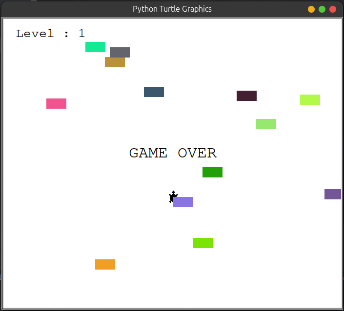
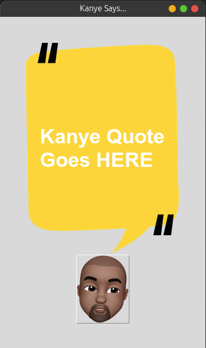
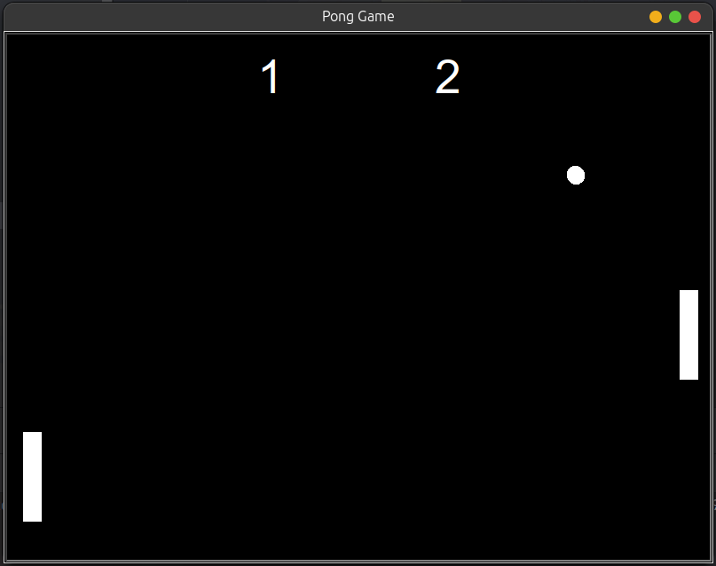
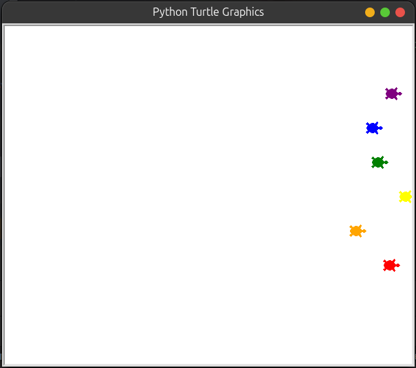

# Python 100-Day Bootcamp Project Collection 🐍💻
This repository contains a collection of over 35 projects developed as part of a 100-bootcamp program. The projects include a variety of CLI applications, a TURTLE app, and a Tkinter app, each designed to reinforce key programming concepts and techniques.

## Project Highlights:
- CLI Applications: A diverse set of command-line interface applications that cover various tasks and utilities, showcasing proficiency in scripting and automation.
- TURTLE Applications: A graphical applications using Python's Turtle module, focusing on drawing and animation techniques.
- TKINTER Applications: A desktop GUI applications built with Tkinter, demonstrating skills in user interface design and event-driven programming.

####  car collision detection game

####  kanye quotes

####  pong game

####  turtle race game

